# <u>Sport Shop</u>

The live Sport Shop site can be viewed [here](https://sport-shop1.herokuapp.com/).
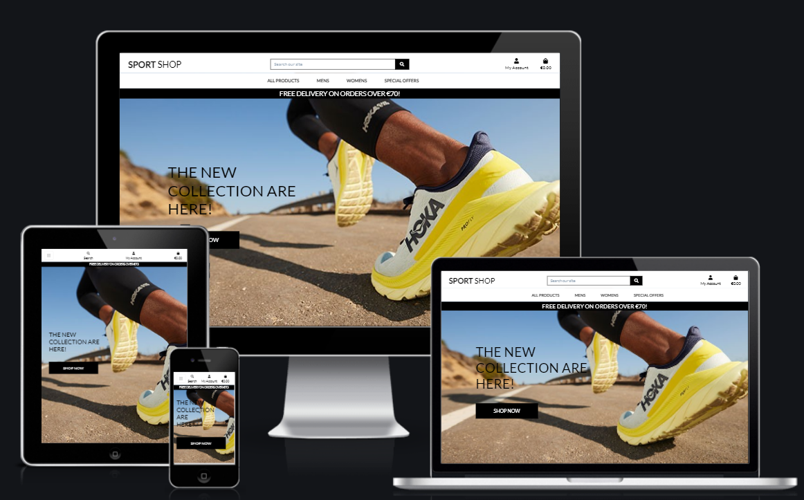

### Aim 
The Sport Shop is an ecommerce website allowing users to purchase sports clothing, shoes and accessories developed for my Project 5 as part of the Code Institute - Diploma in Software Development (Full stack) Diploma.

## Table of Contents
- [User Experience](#user-experience)

    - [Strategy](#strategy)

    - [User Stories](#user-stories)

    - [Scope](#scope)

    - [Structure](#structure)

        - [Databases](#databases)

- [Features](#features)

- [Technologies Used](#technologies-used)

- [Testing](#testing)

- [Validator Testing](#validator-testing)

- [Bugs Found](#bugs-found)

- [Deployment](#deployment)

- [Credit](#credit)

- [Acknowledgments](#Acknowledgments)

# User Experience 

# Strategy 

This website is for a Business to Consumer business that sells sports clothing, shoes and accessories. The target market for these products:

- Women & Men who enjoy sports and working out.
- Women & Men who enjoy accessorising their sport outfits.
- Women & Men aged between 18 and 50.

I believe the customers will need a website that is:

- Easy to Navigate and filter/search by category.

- Has the ability to view and purchase items.

- Has the ability to filter which gender the customer is.  

- User account functionality to store delivery information.

The owner will need a website that:

- Appealingly displays their products.

- Allows them to add, edit and remove products.

- Allows customers to get in contact if any issues arrise. 

# User Stories 

## Admin/Superuser
1. As a Site Owner I want to be able to add a product so that I can add more items to my store.
2. As a Site Owner I want to be able to Edit/Update a product so that I can change the price.
3. As a Site Owner I want to be able to delete a product so that I can remove items that are no longer available.

## Customer
1.	As a Customer I want to be able to view a list of items so that I can add them to my basket.
2.	As a Customer I want to be able to click into an item so that I can view a product and add it to the basket.
3.	As a Customer I want to be able to add items to my basket so that I can keep track of what I am spending.
4.	As a Customer I want to be able to adjust the number of products in my basket so that I can make changes to my purchases before checkout.
5.	As a Customer I want to be able to enter payment information so that I can check out quickly.
6.	As a Customer I want to be able to feel that my personal and payment details are safe and secure so that I can confidently carry out my purchase.
7.	As a Customer I want to be able to view an order confirmation so that I can verify my order is correct.
8.	As a Customer I want to be able to receive an email confirmation of my order so that I have proof of my order was successful.
9.	As a Customer I want to be able to sort by price, name, rating and category. 
10.	As a Customer I want to be able to easily register for an account so that I can have a personal account and view my profile and purchase history.
11.	As a Customer I want to be able to reset my password if I have forgotten it.
12.	As a Customer I want to be able to receive a confirmation email when I sign up to the website.

# Scope 

To achieve the above user and business goals, this project will be created with the following features:

- Site Navigation containing a Search Bar, My Account Links, Shopping Bag links, and Product Categories sections.

- A Landing Page that clearly demonstrates what the site is about.

- A Products Page that lists the Products contained within the category/search carried out.

- Products Cards that gives the user an image of the product along with name, price, rating.

- Registration/login functionality using Django AllAuth so that users can create and manage their account.

- A User Profile Page so that users can save delivery details for faster orders in future and to see their order history.

# Structure

This project is structured with a homepage that greets the user with a clear navigation bar at the top of the page to search for the item required or to browse all products. There is the ability to sort items by price, rating, name, and by category as well as the ability to search for a product by typing keywords into the search bar.

Users have to create a profile for themselves which contains their delivery address and it contains their order history.

The website is made of the following apps:
1. Home
2. Products
3. Profile
4. Bag
5. Checkout

## Databases
### Category

The Category model is required so that the site owner can assign products to a Category. This model allows for filtering functionality so that shoppers can search for items wanted by new arrivals, deals and all specials. 

### Products
The Products model is required to add products for sale to the site. The site owner only can add, edit, and delete products from here and all users can view the full product list on the site.

### Order & Order Line Items
The Order model holds the order details of an order placed by the customers. This is connected to the Order Line Items model which contains the products ordered by the customers.

### User

For this project, I also used Django's User model to store registration information allowing the users to create an account. Once an account has been created the user is able to create, update and delete their own information on the site. 

### User Profile

The User Profile contains delivery information for those who created an account and chose to store their delivery details for faster checkout.

# Features

## Homepage

### Shop Name/Logo

### Search Bar 

### My Account 

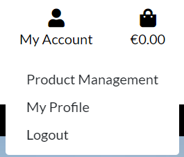

### Shopping Bag 

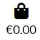

### Bootstrap Toast

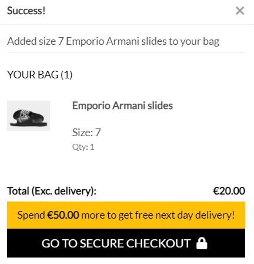

### Product Navigation

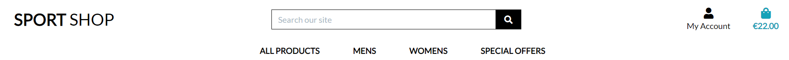

### Delivery Banner

### Homepage Message

## My Account

### Account Registration

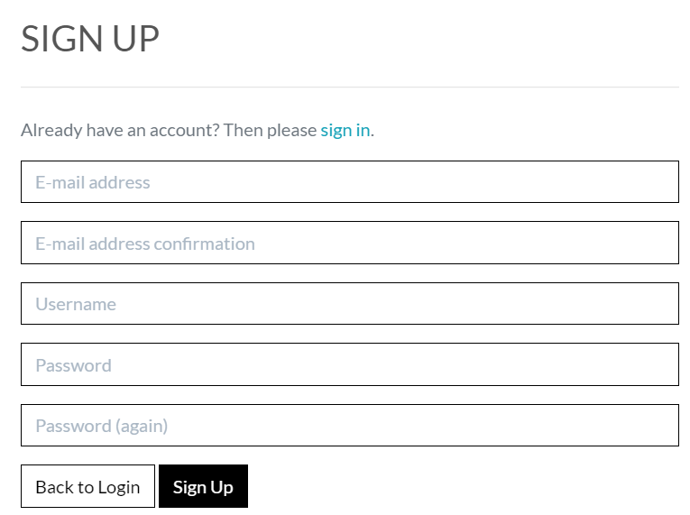

### Signin

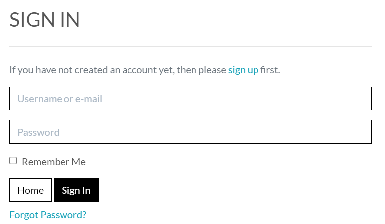

### My Profile

- Delivery Information

- Order History

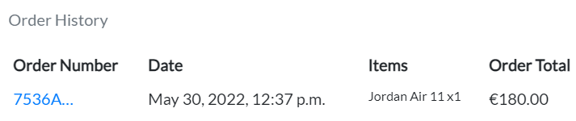

- Order Confirmation

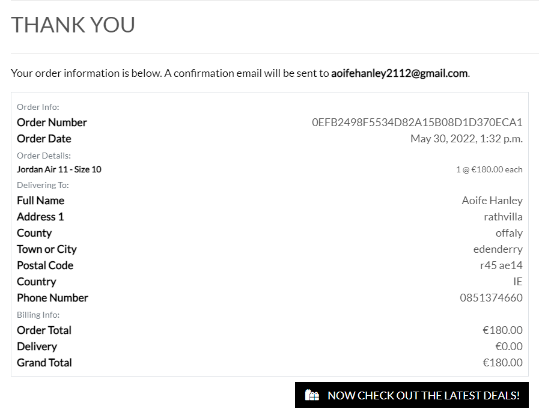

### Signout

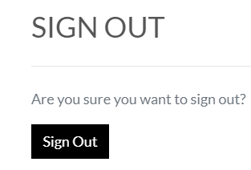

# Products Page & Product Rating

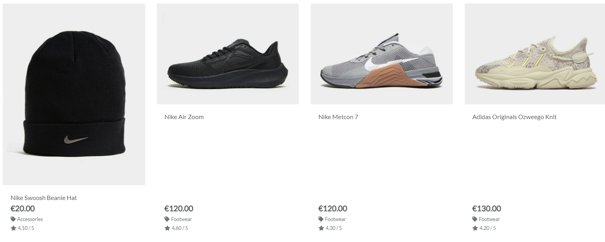

# Order Confirmation Email

# Admin Features

## Product Management
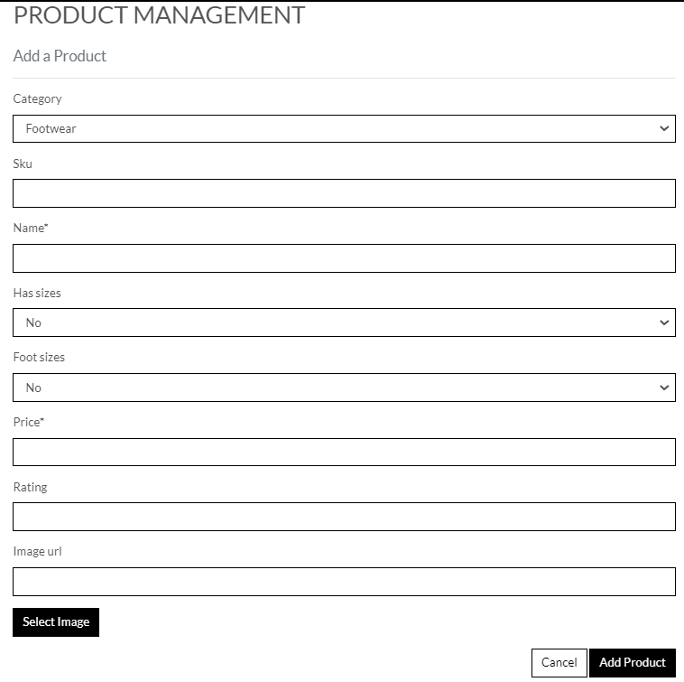

## Edit Products
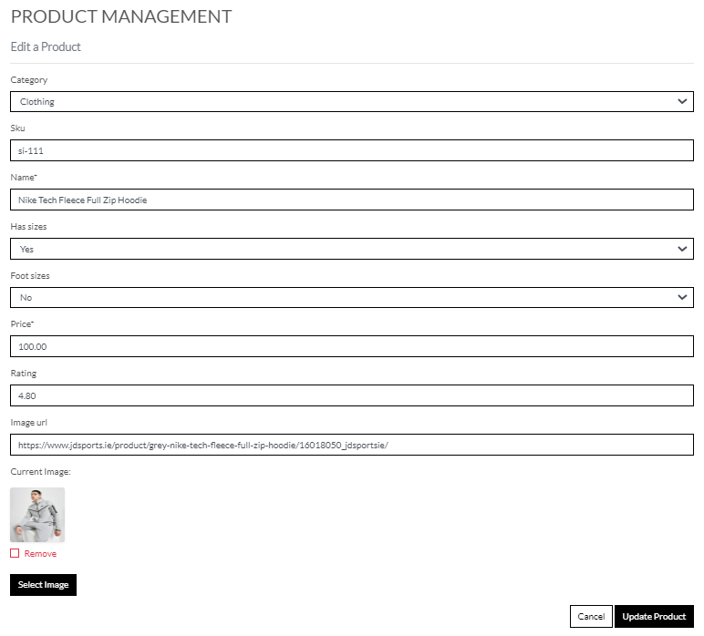

## Delete Products
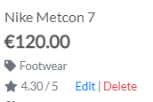

# Technologies Used
## Languages Used

[HTML](https://en.wikipedia.org/wiki/HTML)

[CSS](https://en.wikipedia.org/wiki/CSS)

[Python](https://www.python.org/)

[JavaScript](https://www.javascript.com/)

## Frameworks, Libraries, and Programmes Used 

[GitHub](https://github.com/) - Holds the repository of my project, GitHub connects to GitPod and Heroku.

[GitPod](https://gitpod.io/workspaces) – Connected to GitHub, GitPod hosted the coding space, allowing the project to be built and then committed to the GitHub repository. 

[Heroku](https://www.heroku.com/) - Connected to the GitHub repository, Heroku is a cloud application platform used to deploy this project so the backend language can be utilised/tested. 

[Django](https://www.djangoproject.com/) - This framework was used to build the foundations of this project, reducing time spent getting the project setup and preventing re-writing existing code.

[Bootstrap](https://getbootstrap.com/) - Used to quickly add design and responsiveness to my website, Bootstrap focuses on mobile first design meaning this website is responsive across multiple devices and screen sizes.

[Font Awesome](https://fontawesome.com/) - Used for all of the icons throughout the site.

# Testing

## **Manual Testing by User Story**

### **Admin/Superuser**
### 1. As a Site Owner, I want to be able to add a product so that I can add more items to my store.
- Products may be added using the Admin Panel or the project management page accessed by clicking on 'My Account.'
- Necessary fields are verifying properly, and error messages are specific to each required field.
- An asterisk (*) appears next to all necessary fields.
- Number fields can only have numbers in them.
- Images are saved in the proper Amazon Web Services Bucket and Folder when they are uploaded.
- The Cancel button returns the user to the Products Page.
- Adding a product takes the user back to the Products Page.
- The user is notified that the product has been successfully added via an alert message in the upper right corner of the page.

### 2.	As a Site Owner,I want to be able to Edit/Update a product so that I can change the price, and other product criteria.
- On the products page, there are edit buttons that can only be accessed by admin/super users.
- Selecting the Edit button brings the user to the product form, which is already filled up with the current data.
- The fields are checked as if they were for a new product; all number fields must be numbers, and mandatory fields must be filled in.
- The image can also be removed and there is no image to replace it. 
- The uploaded picture has the name as an existing image.
- In the upper right corner of the page, an alert message appears to let the user know which product they are now modifying.
- Update product updates the new product information and takes the user back to the products page.

### 3.	As a Site Owner, I want to be able to delete a product so that I can remove items that are no longer available.
- Deleting a product from a product model eliminates it.
- The product has been removed from the live product list.
- When the product is successfully removed, a success notice appears at the top right of the page.

### **Customer**
### 1. As a Customer, I want to be able to view a list of items so that I can add them to my basket.

- To guarantee that the card layout varies depending on screen size, all items are shown using Bootstrap Cards and Responsiveness classes.
- Products may be seen together or by category, and the sort box on the top right of the product pages can be used to further filter them.
- All product photographs are shown, and if none are available, there is no image to replace them.
- The product card must provide a name, price, rating, and category for all goods.
- Non-superusers are unable to utilize the Edit and Delete buttons.

###	2. As a Customer, I want to be able to click into an item so that I can view a product description and add to the basket.

- When you click an item, it takes you to the appropriate item with the product image, title, and price all match the product card.
- The user may see how the product they're looking at is rated.

### 3. As a Customer, I want to be able to add items to my basket so that I can keep track of what I am spending.

By checking the items added to the Shopping Bag, the following scenarios were tested: 
- Add an item to the bag and double-check that it is in there with the proper amount.
- Before adding to the shopping bag, increase the quantity and double-check that the quantity in the bag matches what was added.
- If the consumer tries to add a number between 0 and 99, they will be disabled if they try to decrease to 0 or increase over 99.
- When an item is added to the shopping bag, a success message shows in the upper right corner, informing the user of the product and amount added, as well as how much more to spend to save on shipping and a link to the shopping bag.
All products were placed to the shopping bag in the correct sequence and tested until the order was finished to check that the items in the shopping bag matched the completed order.

### 4. As a Customer, I want to be able to be able to adjust the quantity of products in my basket so that I can make changes to my purchases before checkout.

By finishing the order and validating what was entered in the admin, the following situations were tested:
- Adding more of a certain item to the shopping bag.
- Reducing the number of items in a shopping bag.
- Removing an item from a shopping bag.
All of the foregoing operations, as well as the proper total delivery and grand total pricing, are accurately displayed in the Order database.

### 5. As a Customer, I want to be able to be able to enter payment information so that I can check out quickly.

Stripe test card numbers were used to test the checkout process.
To verify that the checkout proceeded smoothly, the following scenarios were tested:
- Placing an order by filling out only the mandatory fields on the checkout form. With a success Webhook message, the order went through on Stripe and was saved in the database.
- Attempting to place an order with false credit card information. Underneath the card details field, an error notice confirms that the information is wrong.
- Using an expired credit card to place an order. The card has expired, according to an error notice that displays beneath the card information form.
- Submitting an order using the form, simply filling in the relevant fields on the checkout form. To mimic a user quitting the page before the checkout success confirmation page has loaded, the submit() function in the stripe elements.js file has been commented out. With a succesful Webhook message, the order was processed on Stripe and placed in the database.
- Submitting an order with a missing or incomplete order form. The user is notified that all mandatory fields are empty and that the form must be completed before it can be submitted.
To confirm that all totals matched, the Order total was compared on the checkout page, the successful checkout page, on Stripe, and within the Order database.

### 6. As a Customer, I want to be able to be able to feel that my personal and payment details are safe and secure so that I can confidently carry out my purchase.
- If the user has an account, address information may be kept and updated/removed as needed.
- The project makes use of Stripe to handle payments, which keeps the user's payment information secure and separate from their user profile.
- None of the project's models store payment information.

### 7. As a Customer, I want to be able to be able to view an order confirmation so that I can verify my order is correct.

- On the profile page of users having a profile, there is a list of orders placed. When the user clicks on the order number, the user is sent to the confirmation page that appeared immediately after they completed the checkout process. The following purchasing details are included in the confirmation:
    - Order Number
    - Order Date
    - Product Name and Quantity
    - Price per item
    - Delivering to
    - Phone Number
    - Address
    - Order Total
    - Delivery Cost
    - Grand Total
- The goods in the bag, the order total, and the order in the database all matched the information on the order confirmation.

### 8. As a Customer, I want to be able to receive an email confirmation of my order so that I have proof of my order for my records.

- Email confirmation was tested by sending an order to a verifiable email address.
- An email confirmation matching the template set up in the checkout app was received with the correct order details within and a contact email for if there was an issue with the order.

### 9. As a Customer, I want to be able to sort multiple categories and products so that I can find the best price of product.

- Testing the sort functionality was done within the all products tab as it contained the majority of products. The sort options tested were:
    - Price (Low to High)
    - Price (High to Low) 
    - Rating (Low to High)
    - Rating (High to Low)
    - Name (A to Z)
    - Name (Z to A) 
    - Category (A to Z)
    - Category (Z to A)

### 10. As a Customer, I want to be able to easily see what I’ve searched so that I can quickly see whether the product is available.
- This was tested by:
    - Searching via the search box
- The search quantity is displayed at the top left of the page, and the number displayed corresponds to the number of searches on each page.

### 11. As a Customer, I want to be able to easily register for an account so that I can have a personal account and view my profile and purchase history.
- This was tested by registering user accounts and:
    - Logging out and back in to ensure they worked
    - Confirming the account via email
    - Checking the Admin panel for confirmed email addresses
    - Attempting to create an account with an email address that already exists.
- The above ensured the user accounts were generated. 
- To test profile information I added an address and attempted to checkout an item. This ensured that the address saved in the profile was auto-filled on the checkout page. To test this further I made an order, ensuring the save details to profile checkbox is ticked and checked the address saved to the user's profile. 
- To test the order history, I checked whether the orders placed to test the profile information had been saved to the profile, and the information contained in the order matched what was placed in the bag and checked out.
- To test that accounts cannot be created with the same email address I attempted to create an account for an email that already exists. An error message occurred after I clicked submit, ensuring I was unable to create the duplicate account.

### 12. As a Customer, I want to be able to reset my password if I have forgotten it.
- This was tested by clicking the 'Forgot Password' link at the bottom of the login page. The user then receives a link via email, therefore I tested this with an existing email to ensure the link was received.
- The user is taken to a page where they reset the password by entering it twice. After the new password has been entered, the user is re-directed to a confirmation page with a bootstrap toast displaying a success message. If the passwords do not match then an error message notifies the user so they can try again.
- Once reset, the user must then re-login with the new password, which was tested to confirm the password change and that the correct user is now logged in.

### 13. As a Customer, I want to be able to receive a registration confirmation email so that I can confirm registration.
- This was confirmed by registering for an account. To complete registration, the user must receive an email with a link that validates their email address. A specifically created email address was used to test this. The email was received, and the account was confirmed using the link.

# Validator Testing

- The HTML templates were validated using [W3 Validator](https://validator.w3.org/). No major errors were returned for the HTML segments.
- The CSS style sheet was validated using [W3C Validator](https://jigsaw.w3.org/css-validator/) and no errors were returned.
- The JavaScript files were run through [JSHint](https://jshint.com/) No errors were found.
- The code was validated using [PEP8](http://pep8online.com/). No errors were returned.

# Bugs Found 

- While working on this project, I ran into the following issues:
- On manage.py file I didn't write the correct code in the app, and this showed me it was an error like this: "No Module Named".
- On the checkout page I didn't close one div and the checkout payment didn't work.
- The policy generator for [AWS](https://aws.amazon.com/?nc2=h_lg) URL wasn't working and I needed to ask Tutor Assistance for assistance to help me fix the file. 
- The Sport Shop page image wasn't loading on the deployed site. To fix this I changed the image source to the images [AWS](https://aws.amazon.com/?nc2=h_lg) URL to display the image.

# Deployment 

This project was deployed using Heroku. Heroku was having a security issue at the time of deployment, this project was deployed using GitPod from the command line, as shown below. As a result, I was unable to enable automated Heroku deployments whenever a commit was published into the repository.

See the following steps to deploy:

1. Log into Heroku and Create a New App.
2. Give the App a name, it must be unique, and select a region closest to you. 
3. Click on 'Create App'. This will take you to a page where you can deploy your project. 
4. Next, click on the 'Resources' tab and search for 'Heroku Postgres' in the Add-ons section to add the Heroku Postgres database to the project. 
5. Click on the 'Settings' tab at the top of the page. The following steps must be completed before deployment
6. Within the settings.py file you need to import os and import dj_database_url at the top. Then, in the command line install dj_database_url and psycopg2 so that we can use Postgres. Freeze these installs into the requirements.txt file.
7. Scroll down to Config Vars (also known as Environment Variables) and click 'Reveal Config Vars'. Here the database URL is stored to run my app on Heroku. 
8. Next I ran the migrations to set up my Postgres Database by running **Python 3 manage.py migrate** within the command line and then create a Superuser using **python3 manage.py create superuser**.
9. Following setting up the database I generated a new Secret Key, to replace the insecure key that was in settings.py and added: **os.environ.get('SECRET_KEY')**. I then added the newly generated key to the Config Vars on Heroku. 
10. We must then install Gunicorn, which will act as our webserver and freeze that into our requirements file.
11. Next I created a Procfile to tell Heroku to create a web dyno that will run Gunicorn and serve our Django app.
12. I then told Heroku temporarily disable collectstatic by using the Heroku config set, disable collectstatic = 1. I added this via Heroku's Config Vars but this can also be added via the command line. This was to prevent Heroku from attempting to deploy the static files, causing an error, until Amazon Web Services was set up. 
13. Then add the hostname of our Heroku app to 'Allowed Hosts' in settings.py as well as localhost so that GitPod will still work too.
14. I then committed and pushed these changes into my GitHub repository so that I could start my first deployment. Once complete, log into Heroku using the following command in the terminal, **heroku login -i**,  and enter your login details.
15. Once logged in, add a remote to your local repository with the Heroku git:remote command and your Heroku app’s name: **heroku git:remote -a <app_name>**
16. Finally, deploy using the following command: **git push heroku main**. Once deployed you can open the app from the command line to ensure it was successfully deployed.
17. Once we can confirm the app deployed successfully, we need to set up Amazon Web Services as this will be where my media and static files are stored. To do this I first created an account with Amazon Web Services. Then, I searched for the service, S3, using the search bar at the top of the page. 
18. Click into it and then click the orange 'Create a Bucket' button. I named this bucked to match my  Heroku app name to keep things simple. Then, I selected my region and changed the 'Object Ownership' setting to **ACLs enabled**. Then, I unchecked block all public access, acknowledged that the bucket will be public, and clicked on the 'Create Bucket' button.
19. Next, on the properties tab, I scrolled to the bottom and turned on static website hosting.
This gave me a new endpoint that I can use to access it from the internet. For the index and error document, I filled in some default values and then clicked Save.
20. Next I'll go to the bucket policy tab a select, policy generator so we can create a security policy for this bucket. The policy type is going to be s3 bucket policy and then allow all principals by using a '*' and the action will be, get object. Next, I copied the ARN which stands for Amazon resource Name from the other tab and paste it into the ARN box at the bottom. I then clicked 'Add statement' and then 'Generate Policy'.
21. I then copied this policy into the bucket policy editor. I then added '/*' at the end of the resource key to allow access to all resources in this bucket and then saved it.
22. Finally, to complete configuration, I went to the 'access control list' tab and checked edit and enable List for Everyone (public access), and accepted the warning box.
23. Next I created a group and a user to access the bucket by searching for the service IAM (Identify and Access Management). I clicked on 'User Groups' and then 'Create User Group' giving it the name. 
24. I then created the Policy used to access our bucket by clicking 'Policies' and then 'Create Policy'. I clicked onto the JSON tab and then selected import managed policy to import one that AWS has pre-built for full access to s3.
25. I searched for s3 and then import the s3 full access policy. I then got the bucket ARN from the bucket policy page in s3 and pasted that into the 'Resource' section on the JSON tab.
26. Finally I created a user to put in the group by going to the User's page and clicking 'Add User'. I created a user name gave them Programmatic Access, and clicked 'Create User'. 
27. I then downloaded the CSV file which contained this User's Access Key and Secret Access Key which I used to authenticate them from my Django app. It is important to download this file as you cannot be re-downloaded and contains the new user's credentials which I next add to the Config Vars on Heroku.
28. Next, I connected Django to the new S3 bucket. To do this I installed two new packages:
- boto3
- django-storages 
29. I installed pip3 freeze these to the requirements.txt file to ensure they're installed on the next Heroku Deploy and added **storages** to our installed apps in settings.py. 
30. The next step is to tell Django that in production we want to use s3 to store our static files whenever someone runs collectstatic and that we want any uploaded product images to go there also. To do that I created a file called custom_storages.py.
31. Finally, to complete the deployment of the AWS setup, I committed the changes and pushed them to GitHub.

# Credit
## Content

- [Stack Overflow](https://stackoverflow.com)

- Website link for image to deploy on heroku
    - [AWS](https://eu-west-1.console.aws.amazon.com/console/home?region=eu-west-1)

- [Font Awesome Icons](https://fontawesome.com/)

- [Logo Font - Google Fonts](https://fonts.google.com/specimen/Raleway?query=raleway)

- [Bootstrap](https://getbootstrap.com/docs/4.2/components/spinners/)

# Acknowledgments
I would like to thank everyone who helped me build my own full-stack E-Commerce website by encouraging and supporting me. To tutor assistance I would also like to thank them as they encouraged me and supported me if I had an issues throughout the project. I would like to thank Adegbenga Adeye, my mentor at Code Institute, for his advice, understanding, and total support.
